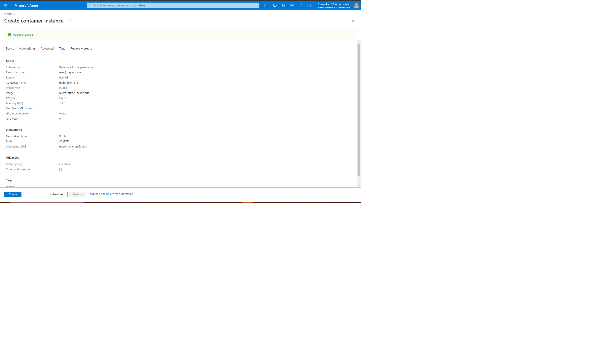
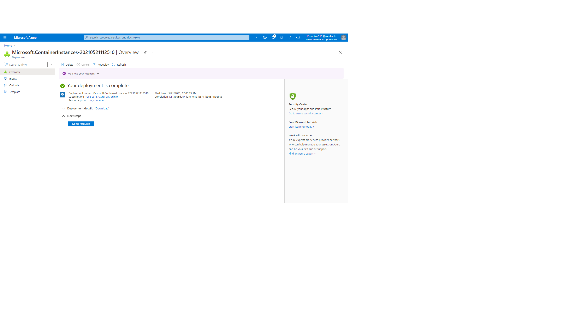
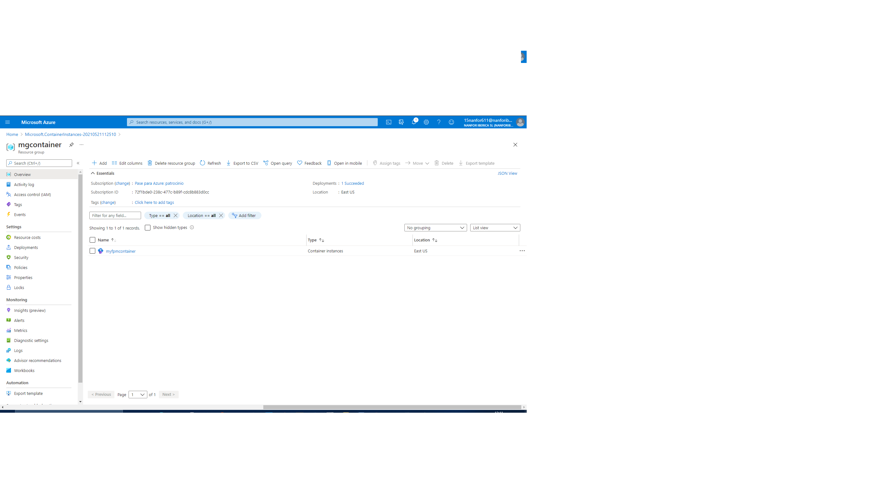
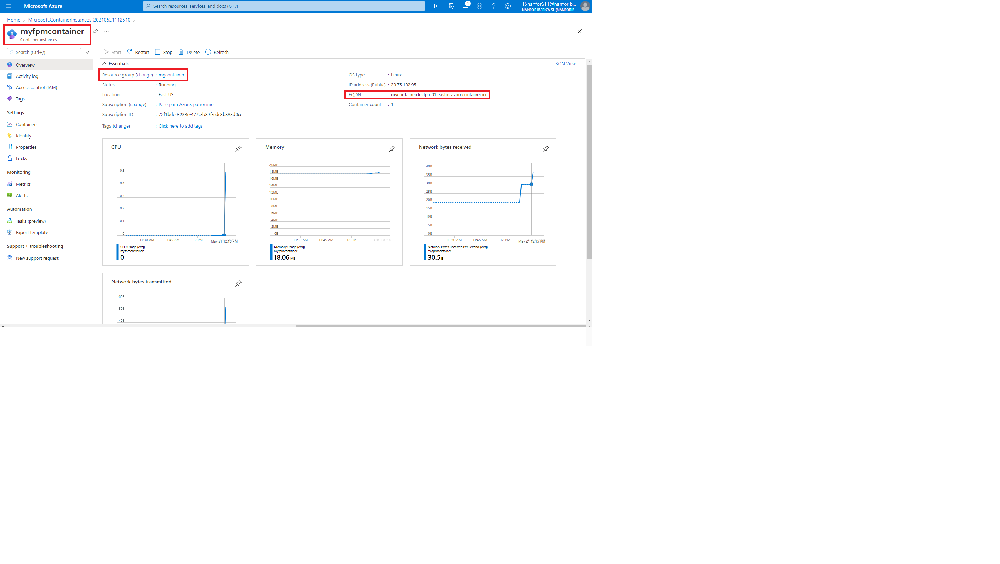
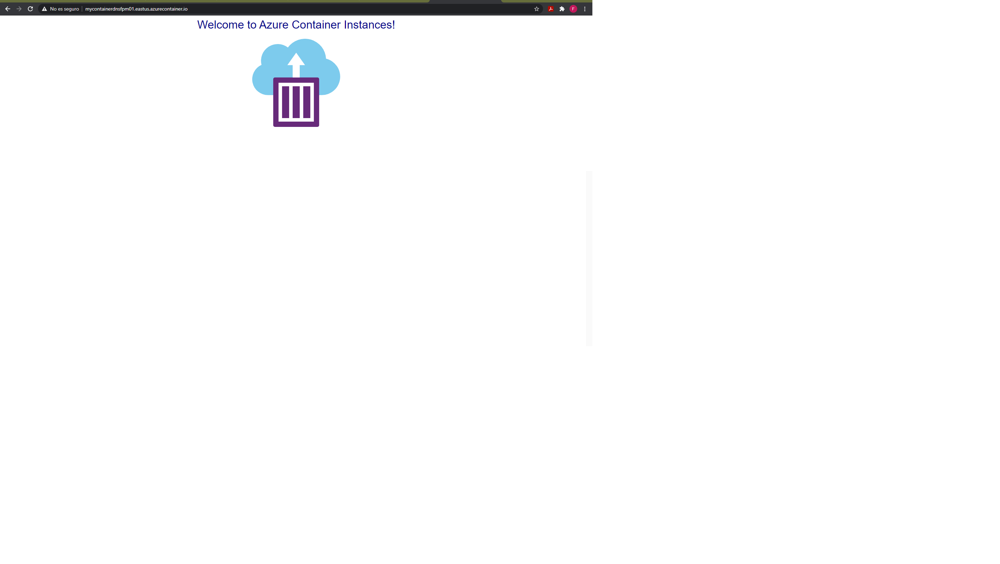
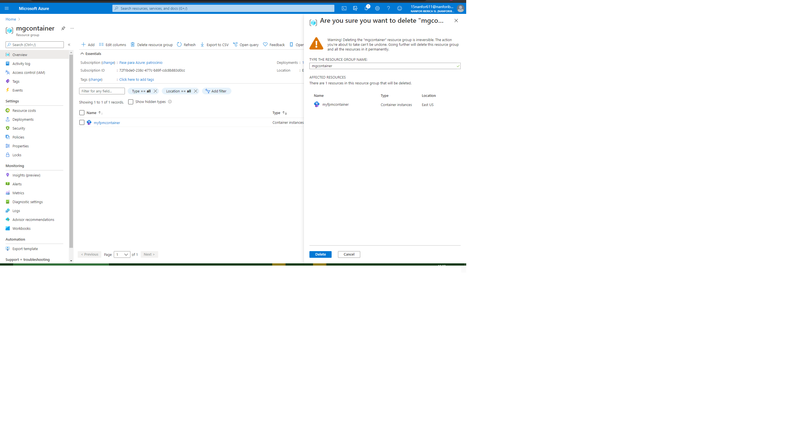
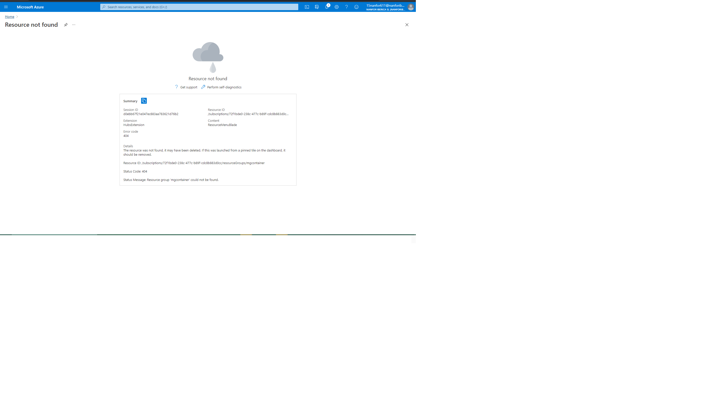

# 03 - Deploy Azure Container Instances

Task 1: Create a container instance

Container instance created and deployment completed.

**Task 2: Verify deployment of the container instance**

Locate the Fully Qualified Domain Name (FQDN).

Copy the container's FQDN into the URL text box web browser and press **Enter**. The Welcome page should display.

Delete resource group

