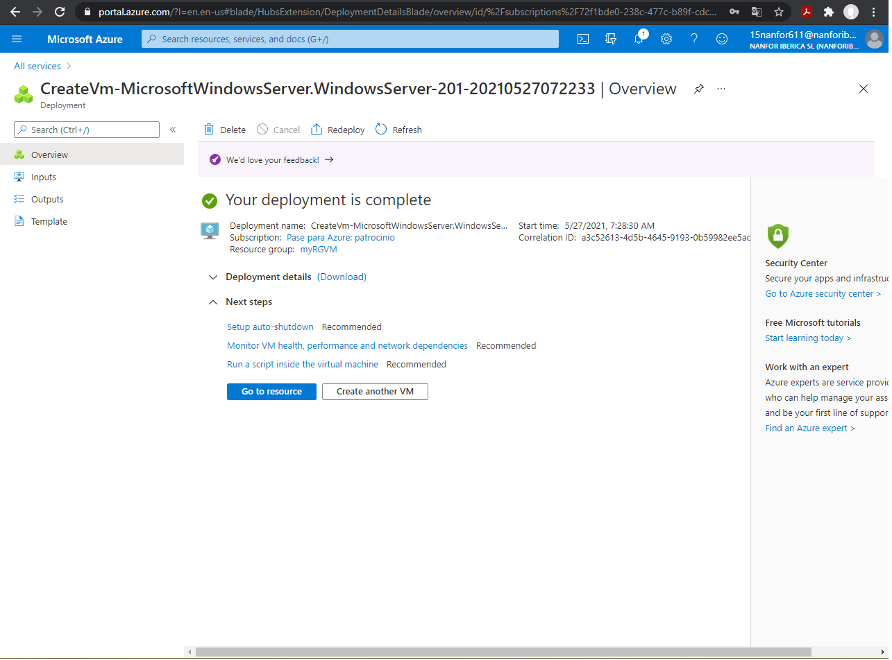
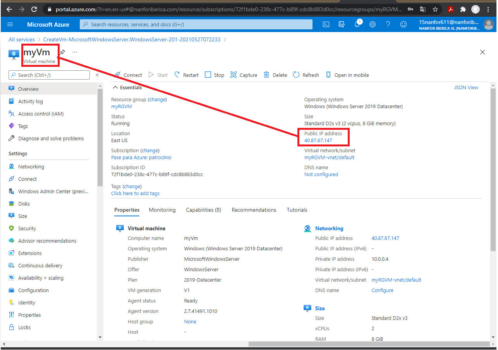
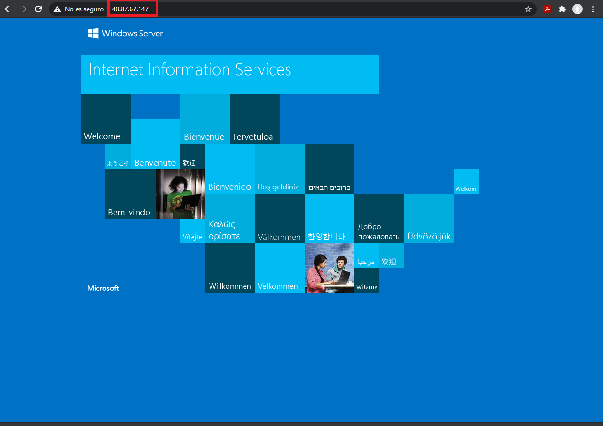
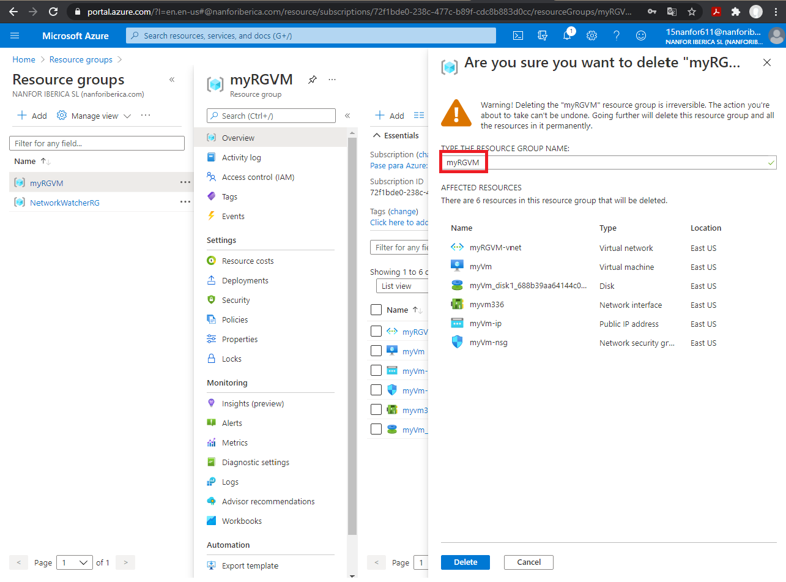
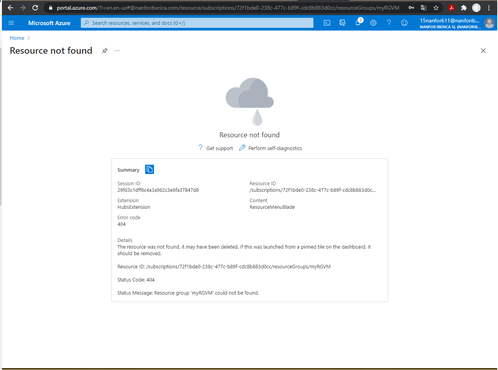
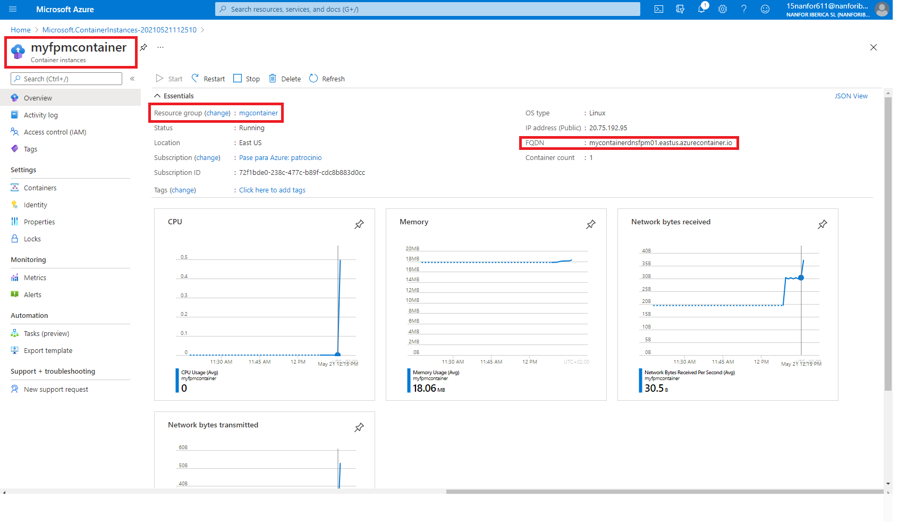

00 - Readme Error Log

# 01 - Create Virtual Machine

# 02 - Create a Web App

# 03 - Deploy Azure Container Instances

Task 1: Create a container instance

Container instance created and deployment completed.

Task 2: Verify deployment of the container instance

Locate the Fully Qualified Domain Name (FQDN).

Copy the container's FQDN into the URL text box web browser and press **Enter**. The Welcome page should display.

Resource group removing

# 04 - Create a virtual network
Task 1: Create a virtual network (20 min)

Virtual Network created

Resource created

Task 2: Create two virtual machines
Create Virtual Machine 1 (VM1)

Deployment completed

Info vm1

vm1 Networking

Create Virtual Machine 2

Deployment completed

Info vm2

vm2 Networking

Task 3: Test the connection
vm1 Overview

vm2 Overview

Connect to Virtual machine vm1 by RDP access

Access to vm1 desktop

Connection test to vm2 (ping)

Control Diagram

Resource group removing

# 05 - Create Blob storage
Task 1: Create a storage account

Task 2: Work with blob storage
Container creation

Blob uploading

Task 3: Monitor the storage account

Resource group removing

# 06 - Create a SQL database

